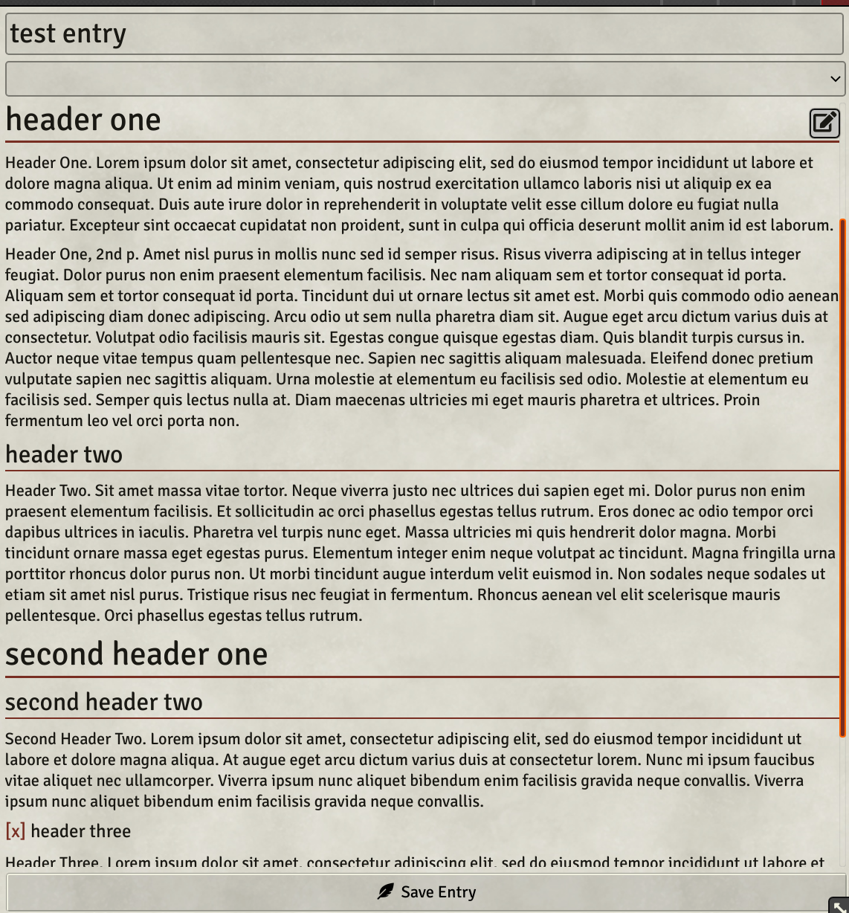
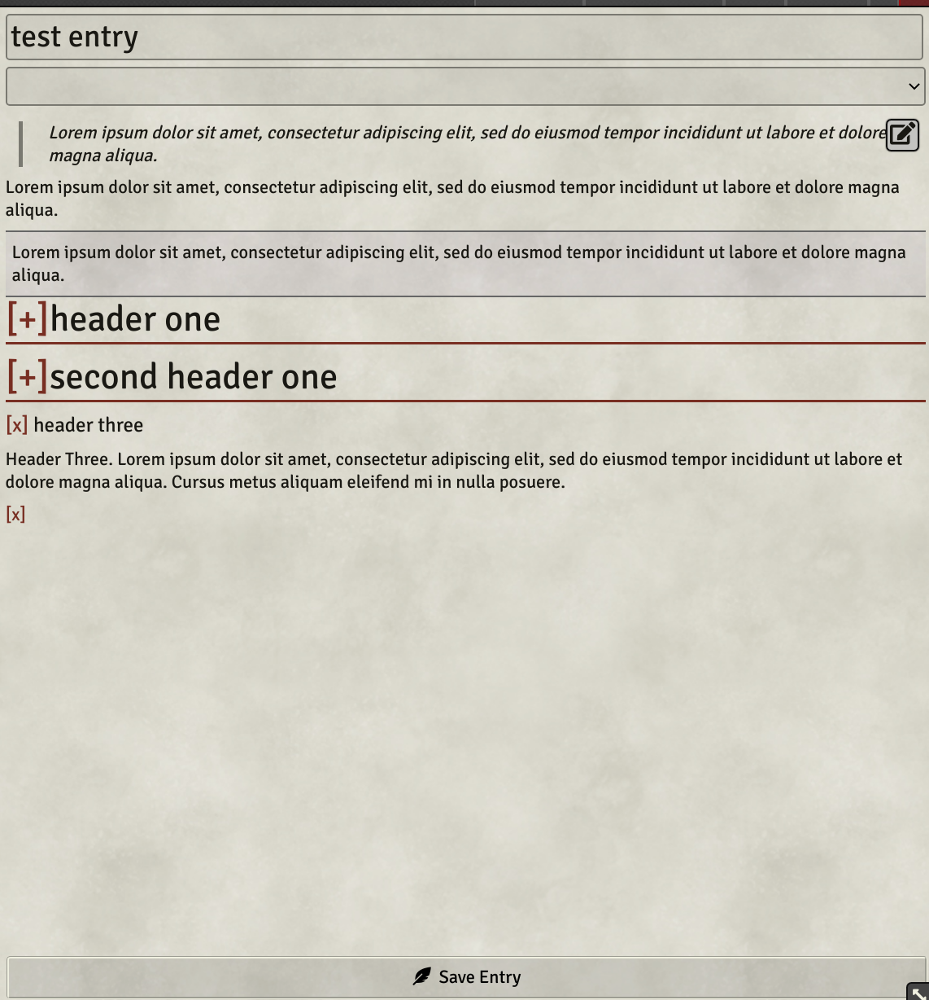
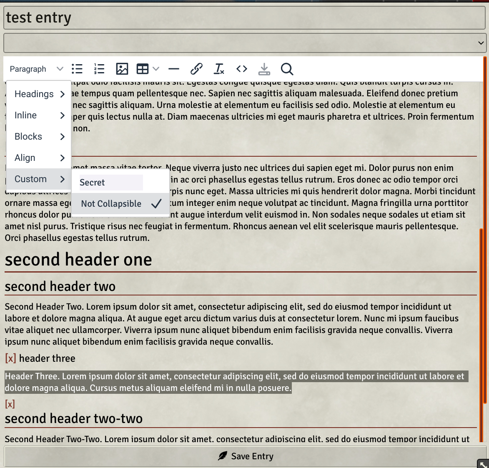
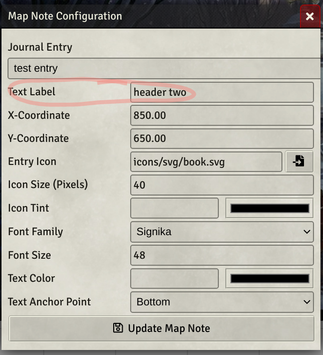
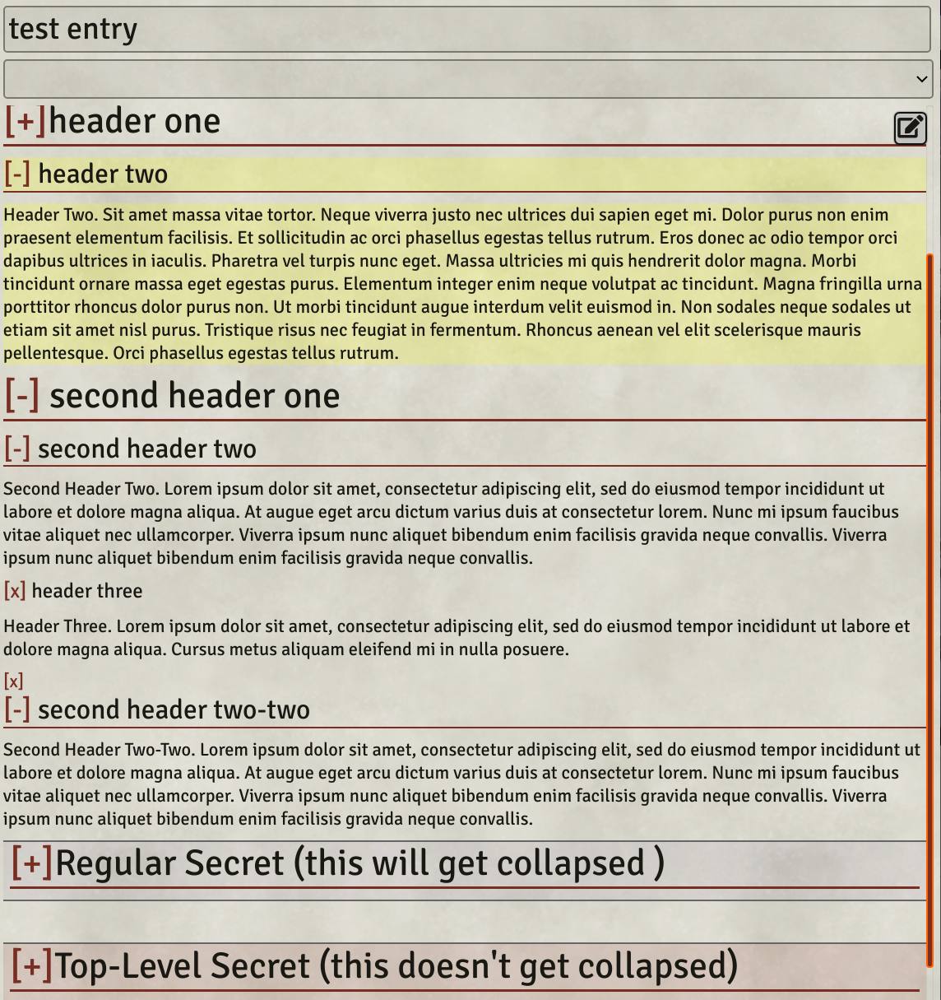
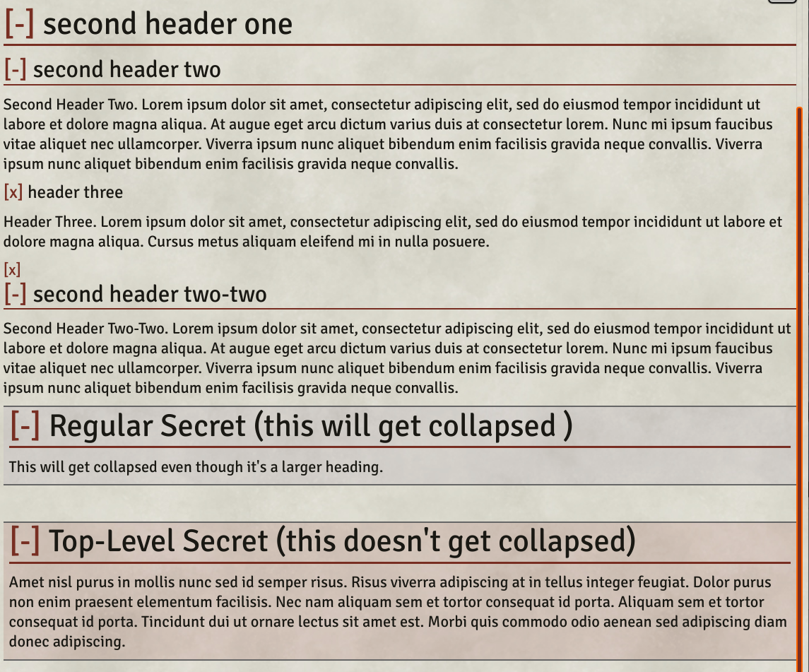

# FVTT Collapsible Journal Sections
**Left Click** a header to expand the section. By default, it will show subheadings, each of which you can click to expand its section, etc.

**Right Click** a header to expand all of its subheadings at once.

Also adds several custom styles that you can use to define sections that won't ever be collapsed and refine the collapse behavior of secret sections.

  
  

## Auto-Collapsible Headings
All headings are automatically collapsible. Just click on a heading to collapse its contents.

## The 'No Collapse' Style
A new custom style called No Collapse is added to the editor. You can find it in the Custom menu.
Apply this style to any text to make it never collapse.
Text before and after it will collapse as normal. 

## Map Note Journal Links
You can also link a map note to a specific section within the journal entry.

Here's How
1. After placing a map note for a journal entry, enter the heading you want to link to in the Text Label field.
2. That’s it! Now when you click that map note to open its journal, if there’s a heading matching the text you entered into the Text Label field, that section will be expanded and its header will be highlighted.

  
  

## Top-Level Secrets
Normal secret sections will collapse into headings just as text would. The new 'Top-Level Secret' style fixes this.  
**Top-Level Secret sections won't be collapsed.**  

_Don't make a section both a secret and a top-level secret. Choose only 1._

  
  

## Settings
#### Default Collapsed State
**_Shown._** When you open a journal entry, all the sections will be shown.  
**_Collapsed._** When you open a journal entry, only top-level headings will be shown.
#### Layout
**_Static._** No mouse hover effects.  
**_Dynamic._** '[+]' and 'Not Collapsible' will be hidden by default and will become visible on mouse hover.
